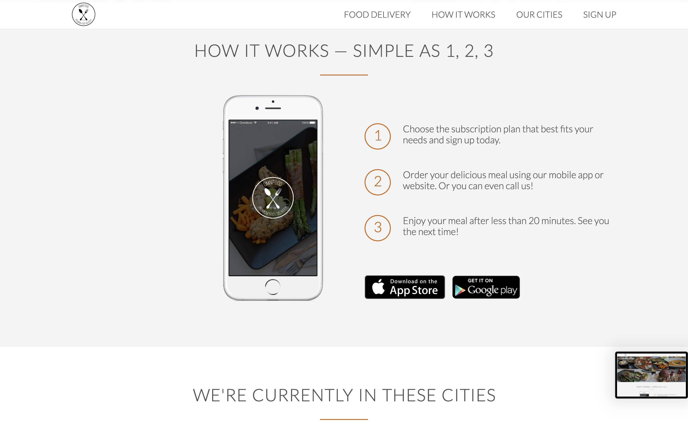
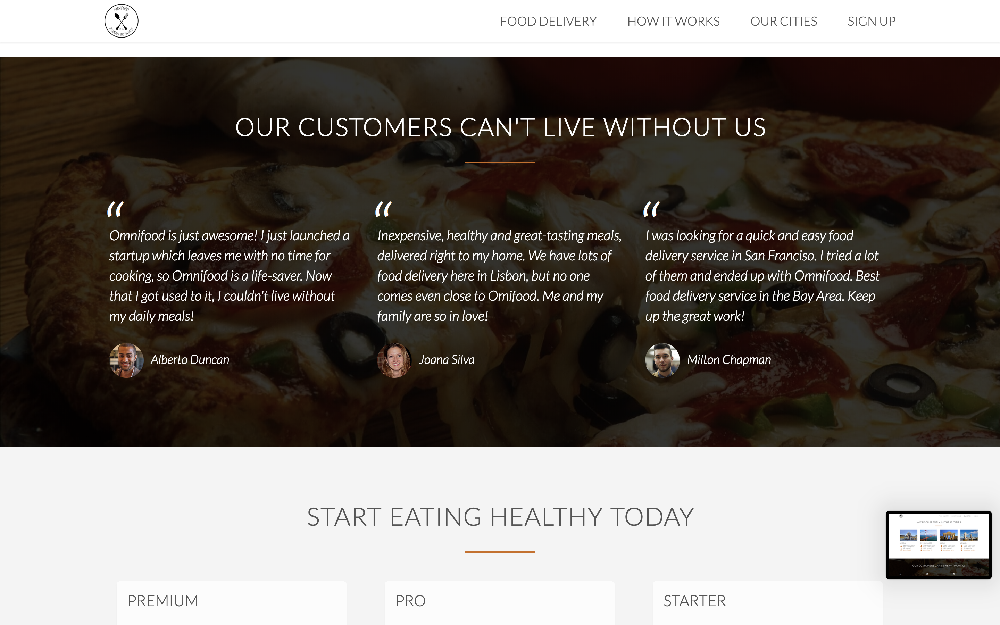
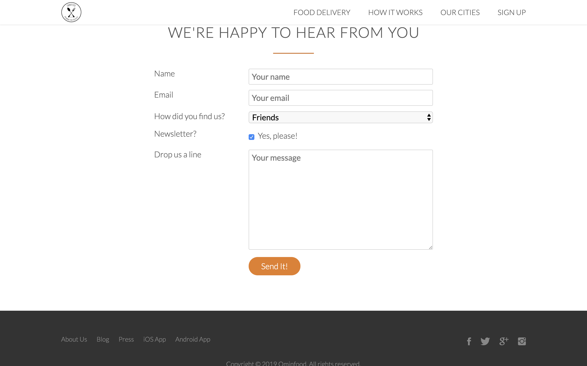

# Food-Business-Website
Fictitious food delivery business. Website is responsive across all devices and was created using html5, CSS3, CSS Grid, Normalize.css and jQuery for the animations and interactivity. Normalize.css is a small CSS file that provides better cross-browser consistency in the default styling of HTML elements. 

